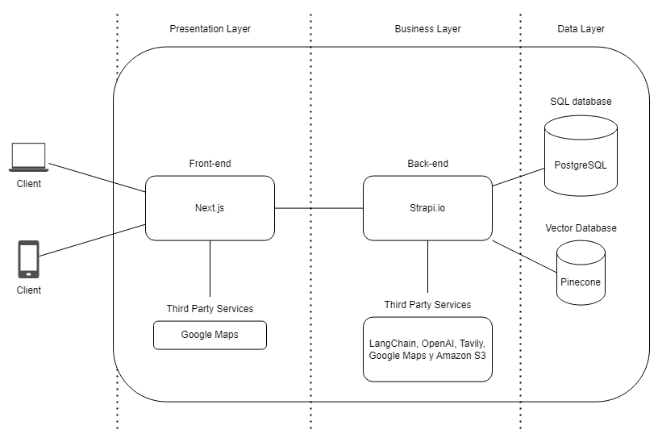

# Guanaquitos: Empowering the future of El Salvador, one student at a time.

## Overview

**Guanaquitos** is a dynamic web platform designed to offer comprehensive vocational guidance and facilitate the search for careers and scholarships for high school students in the Antiguo Cuscatlán district of El Salvador.

Leveraging web technologies, open-source solutions, and artificial intelligence, Guanaquitos aims to become the go-to resource for Salvadoran students, providing them with crucial tools and information to shape their educational and professional futures.

The inspiration for Guanaquitos stemmed from a deep-seated desire to improve the future of El Salvador by enhancing its educational system. Cristina Ramirez, an orientation counselor, highlighted the absence of a centralized platform for Salvadoran students to find careers, scholarships, and receive personalized guidance. This project, initially conceived as a graduation project, has evolved into a personal mission to support Salvadoran youth.

## Key Features

- **Vocational Guidance Test:** A vocational guidance test based on the Holland typological theory. Holland's theory categorizes people into six personality types: Realistic, Investigative, Artistic, Social, Enterprising, and Conventional (RIASEC). By aligning these personality types with compatible career environments, the test provides personalized guidance for students, enabling them to pursue careers that best fit their inherent traits and preferences.
- **Search:** Allows students to search for resources, careers and scholarships.
- **Repositories:** Comprehensive repositories of scholarships, careers, and resources tailored to Salvadoran students.
- **Counselor Information:** Provides contact information for counselors to offer personalized guidance and support.
- **AI-Powered Chat:** Utilizes generative AI integrated with a vector database to assist students in finding relevant information and taking guidance tests.

## Architecture



The selected architecture consists of three layers: the presentation layer, the business layer, and the data layer.

### Presentation Layer

The presentation layer is responsible for user interaction, managing how information is displayed and received.

Next.js is used as an extended framework of React.js for front-end development because it allows the construction of robust, high-quality applications that are production-ready. This choice facilitates the future incorporation of more developers into the project since Next.js and React.js are widely known and used tools.

Google Maps service is used in the application developed with Next.js to enrich the user experience by providing geospatial functionalities.

### Business Layer

The business layer handles the core logic of the application. It manages all the rules, processes, and operations required to meet the system's functional needs. It acts as a bridge between the presentation layer and the data layer, managing user requests, executing necessary operations on databases and other services, and then returning the appropriate response to the presentation layer.

Strapi is chosen as the CMS in the business layer for its ease of use and efficient content management. Its intuitive interface allows customization according to the project's needs. Being open source, it offers flexibility and has no licensing costs, along with an active community that continuously improves the platform. Its compatibility with TypeScript is beneficial since this language is also used in the presentation layer, making it more attractive for development that works extensively with TypeScript.

The business layer uses several third-party services to extend and enhance its functionalities.

- **LangChain**: Used because it helps develop applications based on large language models (LLMs). It abstracts technical complexity, provides integration tools, functionalities for common tasks, supports multiple models, and offers a flexible architecture, making it the ideal tool to focus on business logic and user experience.
- **OpenAI**: Its large language models (LLMs) are used to implement chatbots and perform data embeddings, enabling the integration of advanced natural language processing capabilities in interactive applications.
- **Tavily**: Used as a tool to improve the efficiency and accuracy of external information searches.
- **Google Maps**: Used to provide geospatial functionalities.
- **Amazon S3**: Known as Amazon S3 (Amazon Simple Storage Service), it is used for the secure and scalable storage of files and data.

### Data Layer

The data layer is responsible for managing, storing, and retrieving the data used by the application. This layer ensures that the data is organized efficiently and is accessible securely and reliably.

Postgres is chosen as the SQL database for its robustness and flexibility to efficiently and securely store, organize, and retrieve Strapi data, besides being easily integrated with Strapi.

Pinecone is used to facilitate the search and retrieval of high-dimensional data embeddings from Strapi. This tool is essential for optimizing the process of querying and analyzing large volumes of data, allowing efficient and accurate retrieval of relevant information.

## Installation

### Pre-requisites

- Git
- Docker

### Steps

1. Clone the repository:

   ```sh
   git clone https://github.com/fdgbatarse1/guanaquitos
   ```

2. Obtain the necessary keys (if you want to collaborate with me, you can ask me for the API keys I use):

   - **Strapi Keys:** Generate keys for your Strapi application.
   - **PostgreSQL Database:** Set up the necessary credentials for the SQL database that will be initialized.
   - **AWS S3:** Create an AWS account, set up S3, and obtain your access keys, region, and bucket name.
   - **Google Maps API Key:** Sign up for Google Cloud Platform, enable the Maps API, and generate an API key.
   - **Pinecone:** Sign up for Pinecone, create an index, and obtain the API key, endpoint, and environment details.
   - **OpenAI:** Sign up for OpenAI and create an API key.
   - **Tavily:** Sign up for Tavily and obtain an API key.
   - **Langchain:** Sign up for Langchain and obtain the necessary keys and endpoint details.

3. Navigate to the backend folder, rename `.env.template` to `.env`, and fill it in with your credentials.

4. Navigate to the frontend folder, rename `.env.template` to `.env`, and fill it in with your credentials.

5. Run the following command at the root of the repository:
   ```sh
   docker compose up
   ```

## Contributing

We welcome contributions! Please see our CONTRIBUTING.md for details on how to get started.

## License

This project is licensed under the [MIT](https://choosealicense.com/licenses/mit/) License - see the LICENSE file for details.

## Contact

For any inquiries or feedback, please contact us at guanaquitos.website@gmail.com.
